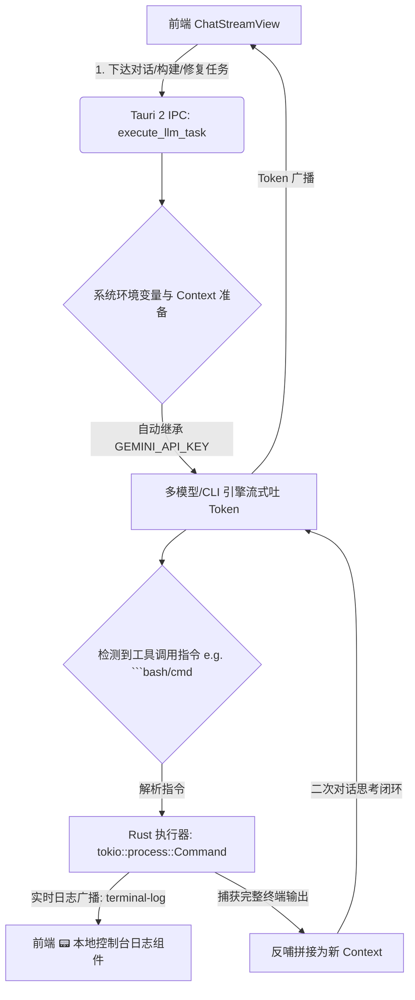

# Celatura Agent 工具调用 (Tool Calling) 与本地控制台流式联动实施计划

### [2026-07-23 15:21:48] Agent Tool Calling 实施方案

---

## 架构与核心流程

---

## 拟修改文件与架构规划

- **[MODIFY] [lib.rs](file:///d:/AI_Tools/Celatura-desktop/src-tauri/src/lib.rs)**：新增 `TerminalLogPayload` 结构体、`run_local_command_and_capture` 终端捕获器与 Tool Calling 命令自动识别反哺机制。
- **[MODIFY] [ChatStreamView.tsx](file:///d:/AI_Tools/Celatura-desktop/src/components/ChatStreamView.tsx)**：新增暗黑风 **📟 本地控制台日志** 组件，监听 `terminal-log` 广播展示终端实时动效。

---

## 验证规划

- 运行 `cargo check` 与 `npm run build`。
- 走查本地终端指令捕获、终端日志同步流式输出与模型自我纠错闭环。
