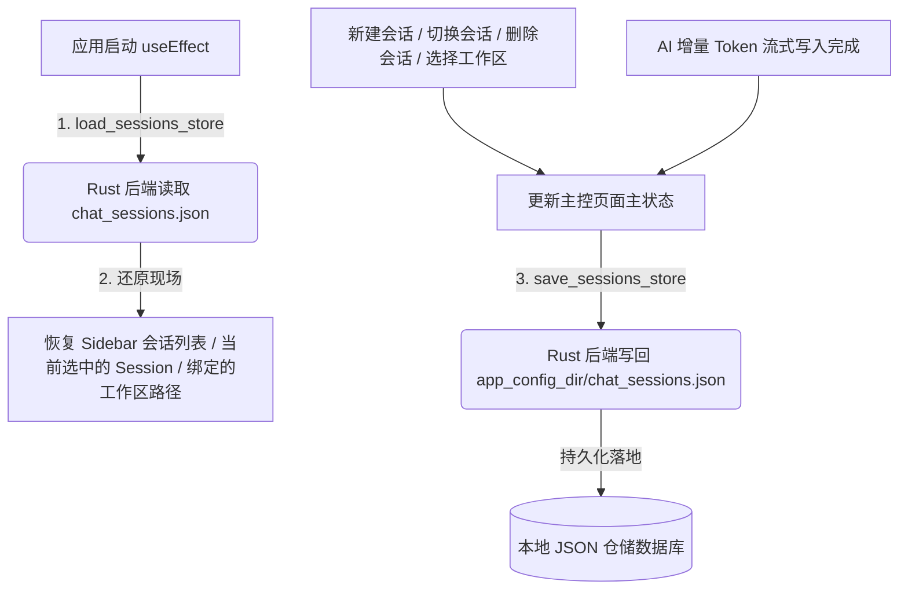

# Celatura 对话历史与工作区状态本地持久化仓储实施计划

### [2026-07-23 16:13:28] 对话历史与状态持久化实施方案

---

## 架构与持久化流设计

---

## 拟修改文件与架构规划

- **[MODIFY] [lib.rs](file:///d:/AI_Tools/Celatura-desktop/src-tauri/src/lib.rs)**：新增 `ChatSession`, `AppSessionsStore` 结构体，添加 `load_sessions_store` 与 `save_sessions_store` Tauri Commands。
- **[MODIFY] [page.tsx](file:///d:/AI_Tools/Celatura-desktop/src/app/page.tsx)**：提升为状态集中控制中心，负责启动恢复与变更防抖落盘。
- **[MODIFY] [Sidebar.tsx](file:///d:/AI_Tools/Celatura-desktop/src/components/Sidebar.tsx)**：渲染真实 Sessions，支持删除会话与新会话创建。
- **[MODIFY] [ChatStreamView.tsx](file:///d:/AI_Tools/Celatura-desktop/src/components/ChatStreamView.tsx)**：与 Active Session / Workspace 绑定，完成 Token 流同步保存。

---

## 验证规划

- 运行 `cargo check` 与 `npm run build`。
- 走查开机恢复现场、新建/删除会话及历史气泡完整保留。
